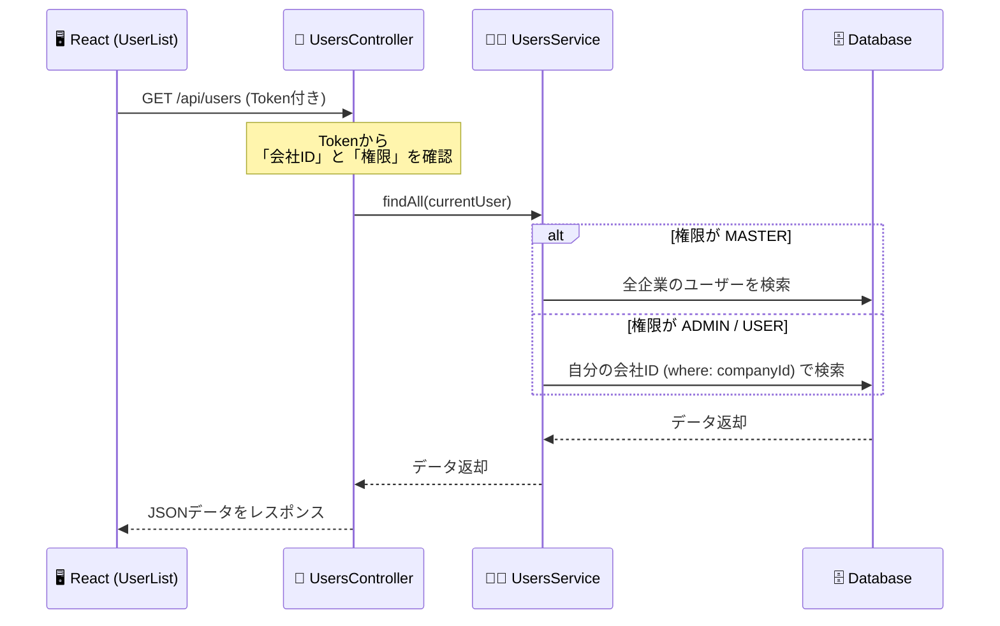

```markdown
# 🚀 SUGIZAKIアプリ 開発ドキュメント

このプロジェクトは、**フロントエンド (React)** と **バックエンド (NestJS)** が分離して連携するモダンなWebアプリケーション構成です。

---

## 🏗 システム構成と仕組み (Architecture)

システム全体を「レストラン」に例えると、以下のような役割分担で動いています。

### 1. 全体像 (The Big Picture)

* **Frontend (店舗エリア)**: `http://localhost:5173`
    * **役割**: 接客担当（UI）。お客さん（ユーザー）からの注文を受け、バックエンドへ伝えます。
* **Backend (厨房・本部)**: `http://localhost:3000`
    * **役割**: 調理担当（API/DB）。注文通りのデータを検索・計算してフロントエンドに返します。
    * **CORS**: 5173番ポート（店舗）からの注文だけを通すように許可設定しています。

```mermaid
graph LR
    User(👤 ユーザー) -->|操作| Front[🖥 Frontend<br>店舗エリア<br>Port: 5173]
    Front -->|APIリクエスト<br>+ 許可証(Token)| Back[⚙️ Backend<br>厨房エリア<br>Port: 3000]
    Back <-->|データの出し入れ| DB[(🗄 Database<br>巨大冷蔵庫<br>SQLite)]

```

### 2. データ取得の流れ (Data Flow)

例：「ユーザー一覧画面」を表示する場合のリレー

1. **Request**: フロントエンドが「許可証(Token)」を持ってバックエンドの窓口へ行く。
2. **Guard**: 警備員が許可証をチェック。「君はA社の人だね」と特定。
3. **Controller (ウェイター)**: 注文を受け取り、Service（シェフ）へ指示を出す。
4. **Service (シェフ)**: **ここで「権限の壁」を作る。** (Masterなら全員分、それ以外なら自社分だけ)
5. **Response**: 完成した料理（データ）をJSON形式でフロントエンドへ届ける。



---

## 🗺 ディレクトリマップ (Directory Role)

ファイルが増えても迷わないための「役割分担表」です。

### 📂 Frontend (`frontend/src`) - 店舗フロア

| ファイル/フォルダ | 役割 | レストランでの例え |
| --- | --- | --- |
| `App.tsx` | **ルーティング** | 「管理者は個室へ」「一般はテーブル席へ」と案内する係 |
| `components/` | **画面部品** | 椅子、テーブル、メニュー表などの備品 |
| `contexts/` | **状態管理** | 店員同士のインカム（「今、誰が来店中？」を共有） |

### 📂 Backend (`backend/src`) - 厨房・本部

| ファイル/フォルダ | 役割 | レストランでの例え |
| --- | --- | --- |
| `auth/` | **認証・認可** | 警備室・入館証発行カウンター |
| `users/` | **ユーザー機能** | 人事部（名簿管理など） |
| `*.controller.ts` | **コントローラー** | **ウェイター**（注文を受け取り、シェフに渡すだけ） |
| `*.service.ts` | **サービス** | **シェフ**（実際にデータをこねて料理を作る人） |
| `entities/` | **エンティティ** | 書類のフォーマット（設計図） |

---

## 💻 開発環境の起動手順 (Getting Started)

開発時は、**2つのターミナル** を開いて、それぞれサーバーを起動し続ける必要があります。

### 1. バックエンド起動 (Server)

* **URL**: http://localhost:3000

```bash
cd backend
npm run start:dev

```

✅ 緑色の文字で `Nest application successfully started` と出れば成功！
*(このターミナルは閉じないこと)*

### 2. フロントエンド起動 (Client)

* **URL**: https://www.google.com/search?q=http://localhost:5173
* **手順**: 新しいタブ/ウィンドウを開いて実行してください。

```bash
cd frontend
npm run dev

```

✅ `Local: http://localhost:5173/` と出れば成功！
*(このターミナルも閉じないこと)*

### 3. ブラウザで確認

Chromeなどで以下にアクセスしてください。
👉 [http://localhost:5173](https://www.google.com/search?q=http://localhost:5173)

---

## 🔑 テスト用アカウント (Test Accounts)

### 初期データ (Seed Data)

`npm run seed` で作成されるデフォルトユーザーです。
**パスワードは全員共通**: `admin123`

| 役割 | ID | Pass | 所属 | 見える範囲 |
| --- | --- | --- | --- | --- |
| **システム管理者** | `master` | `admin123` | SugiTech Master | **全データ** |
| **企業管理者** | `superadmin_a` | `admin123` | Client Corp A | **自社のみ** |
| **部署マネージャー** | `manager_sales` | `admin123` | Client Corp A | **自社のみ** |
| **一般スタッフ** | `staff_01` | `admin123` | Client Corp A | **自社のみ** |

### 手動テスト用データ (Manual)

画面から手動登録時の推奨設定

* **ID**: `sugi_staff`
* **Pass**: `password123`

---

## 📅 開発ロードマップ (Roadmap)

### 完了 (Done) ✅

* [x] **バックエンド刷新 (NestJS)**: Pythonコードを全削除し、TypeScript(NestJS)へ完全移行
* [x] **データベース構築**: SQLite + TypeORM でのリレーション構築
* [x] **認証機能 (Auth)**: JWTを使ったログイン・権限管理 (MASTER / ADMIN)
* [x] **会社管理機能 (Company)**: 会社の一覧表示・新規登録
* [x] **ユーザー管理機能**: ユーザー一覧表示（権限別の表示制御含む）

### 開発中 / 今後の予定 (Todo) 🚧

* [ ] **ユーザー新規登録**: 画面からのユーザー追加機能
* [ ] **クイズ・問題管理**: 問題の作成・編集API
* [ ] **学習履歴ログ**: 受講結果の保存と可視化

```

```